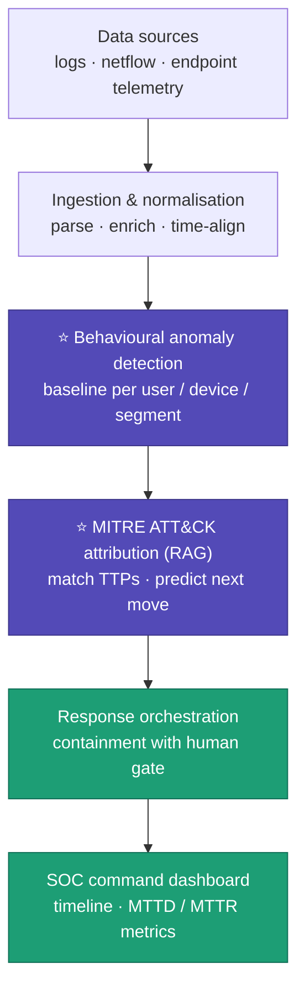
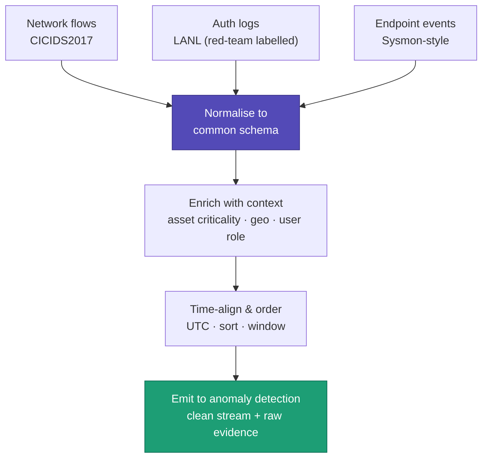
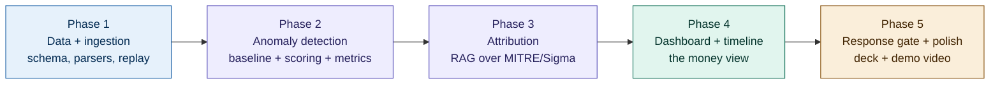

# Cyber Resilience — Solo Hackathon Battle Plan
### ET AI Hackathon 2026 · Problem 7: AI-Driven Cyber Resilience for Critical National Infrastructure

---

## 0. The winning thesis (say this in one breath)

> Attacks on government infrastructure are found **weeks or months too late** because traditional tools wait for known malware *signatures*. We detect attacks by **how systems behave abnormally** — fusing auth, network, and endpoint signals into one timeline — so we catch novel, low-and-slow APTs that signature tools miss, and we map them to MITRE ATT&CK with a recommended response in seconds.

Everything below serves that sentence. It covers Innovation + Business Impact (50% of the score) on its own.

---

## 1. Solo scope reality check (read this first)

You are one person. The problem statement lists five possible components. **You will build one core pipeline well and *simulate* the rest convincingly.** Judges reward a sharp, working demo with real numbers over a sprawling half-built platform.

| Build for real | Fake / simulate (clearly labelled) | Cut entirely |
|---|---|---|
| Ingestion + normalisation of 2 sources | Live streaming (replay a dataset on a timer) | Real Wazuh/Shuffle/TheHive deployment |
| Behavioural anomaly detection (1 solid model) | Response actions (show "would isolate host X") | OT/ICS protocol parsing |
| MITRE ATT&CK attribution via RAG | Multi-tenant / scale infra | Cyber digital twin |
| One SOC dashboard with the money timeline | Autonomous containment execution | Vulnerability prioritisation engine |

**Golden rule:** real ML does the *detection*; the LLM does the *reasoning and explanation*. Don't let the whole thing become an LLM wrapper — judges scoring Technical Excellence (20%) will notice.

---

## 2. System architecture

A single intelligence pipeline from raw telemetry to coordinated response. The two highlighted stages are your "brain" and your differentiation.



---

## 3. Ingestion & normalisation layer

Your data sources speak different languages; everything downstream needs them to speak one. This layer's whole job is to make three sources look like one clean, time-ordered stream.



### The common event schema (the heart of it)

Every source maps onto this. Each parser fills what it can and leaves the rest null.

```json
{
  "timestamp": "2017-07-05T15:32:16Z",   // UTC, ISO8601
  "event_type": "auth",                  // network_flow | auth | process
  "source_entity": "U342@DOM1",          // canonicalised identity
  "dest_entity": "C553",
  "src_ip": null,
  "dst_ip": null,
  "src_host": "C1115",
  "dst_host": "C553",
  "action": "login",                     // login | connect | execute
  "outcome": "success",
  "bytes": null,
  "duration": null,
  "src_internal": true,                  // from enrichment
  "asset_criticality": "high",           // from enrichment (lookup table)
  "source": "lanl",
  "labels": ["redteam"],                 // ground truth for precision/recall
  "raw": "151036,U342@DOM1,..."          // untouched original = audit trail
}
```

> **Why `raw` matters:** it's your evidence trail and maps directly to the "full auditability of every automated action" evaluation criterion. When you flag something, you can show the exact records that triggered it.

### The money moment (build your demo around this)

After normalisation + enrichment, your timeline for host `C553` reads:

```
15:32:16  auth      U342@DOM1   C1115 → C553       login NTLM success   [redteam]
15:32:19  process   U342@DOM1   on C553            execute cmd "whoami"
15:32:24  network   C553 → 52.84.23.17:443         outbound, new dest
```

Each event alone is unremarkable — every signature tool waves all three through. *Fused on one timeline for one entity*, they trace lateral movement → reconnaissance → outbound beacon. **That correlation, with the red-team label confirming it was a real attack, is the screenshot that wins the room.**

---

## 4. Datasets

| Dataset | Role | Why |
|---|---|---|
| **CICIDS2017** or **UNSW-NB15** | Network anomaly core | Labelled normal + attack flows, pre-extracted features. UNSW is smaller/cleaner; CICIDS more realistic. |
| **LANL Authentication** | APT "low-and-slow" story ⭐ | Contains **real red-team events** buried in normal enterprise logins — perfect lateral-movement narrative + ground-truth labels. |
| **OTRF/Security-Datasets** | Ready ATT&CK-mapped telemetry | Pre-recorded attack events mapped to Sigma + Atomic Red Team + ATT&CK. Safe (no live attacks). |
| **MITRE ATT&CK STIX/JSON** | RAG knowledge base | The technique corpus your attribution layer retrieves from. |
| **CERT-In advisories** (scrape) | India-specific RAG context | Localises your project — a differentiator nobody else has. |

> Avoid **NSL-KDD** as your headline (1999 traffic, looks dated). Fine as an hour-1 pipeline smoke test only.
>
> **Your accuracy metrics must come from labelled datasets (LANL/CICIDS), never from knowledge repos.** Keep that line clean or you undercut your own evaluation story.

---

## 5. Resource arsenal (from research)

Organised by the job it does. Assemble on these; make your *original* contribution the detection logic + India framing + fused-timeline correlation.

### Closest prior art — study, don't clone
| Resource | What it is | How you use it |
|---|---|---|
| **zhadyz/AI_SOC** | Near-mirror of this architecture: LLM triage, RAG over MITRE/CVE, ML on CICIDS2017, correlation engine with kill-chain + Markov prediction, response orchestrator with blast-radius gates | Reference map for service breakdown. **Do not copy** — judges can clone it too. |
| **Heimdall writeup** (Medium, RadDr) | Multi-agent SOC triage; "enrich before you reason"; approval workflow to limit blast radius | Steal the *enrich-deterministically-then-LLM* pattern and the human-gate design |
| **Awesome-LLM4Cybersecurity** (tmylla) | 754+ paper index, updated June 2026 | Cite recent techniques in your deck = signals depth |

### MITRE knowledge + detection→response mapping
| Resource | What it is | How you use it |
|---|---|---|
| **Sigma** | Detection rules as code, ATT&CK-tagged | Structured corpus for your RAG layer |
| **Atomic Threat Coverage** | Auto-maps Sigma detection → ATT&CK → response playbook → mitigation | Pre-built knowledge graph for attribution AND response layers |
| **mitreattack-python** + ATT&CK Navigator | Programmatic technique lookup + visual coverage layer | Navigator screenshots straight into the deck |
| **mukul975/Anthropic-Cybersecurity-Skills** | 754 analyst playbooks, framework-mapped (Apache 2.0) | Richer RAG corpus than raw STIX — practitioner workflows per technique. *(Community project, NOT official Anthropic — credit correctly.)* |

### Attack data / demo fuel
| Resource | What it is | How you use it |
|---|---|---|
| **OTRF/Security-Datasets** | Pre-recorded ATT&CK-mapped telemetry | Safe labelled attack events — start here |
| **Atomic Red Team** | Portable ATT&CK-mapped attack tests | Generate fresh telemetry **only in an isolated VM** — but you likely don't need to; OTRF gives you the output safely |

### SOAR/SIEM plumbing — optional, skip unless you have spare time
| Resource | What it is | Verdict |
|---|---|---|
| **Wazuh** | Open SIEM/XDR with built-in ATT&CK mapping | Use only as an alert *source* if at all — full deploy eats a day |
| **Shuffle** | Open-source SOAR, visual workflows | Skip for solo; simulate response instead |
| **TheHive / Cortex** | Case management + observable enrichment | Skip for solo |

---

## 6. Tech stack by layer

| Layer | Pick | Notes |
|---|---|---|
| Ingestion / "streaming" | Python generators + timer replay | Compress time ~100× so a day of logs plays in minutes. No Kafka needed. |
| Anomaly detection | **PyOD** (Isolation Forest / autoencoder) or scikit-learn; **River** for online | Start with Isolation Forest — working detector in an hour. |
| Attribution (RAG) | **Claude API** + **Chroma** (vector DB) + direct calls (or LlamaIndex) | Embed MITRE/Sigma/skills corpus; retrieve by technique. |
| Attack-path graph (optional) | **Neo4j** | A graph of the attacker's path is a memorable demo visual. |
| Backend | **FastAPI** | Lightweight, wires ML + LLM behind a clean API. |
| Dashboard | **Streamlit** (fast, solo-friendly) or React + Recharts (more polished) | Solo → Streamlit unless you're fast at React. |
| Response | Python functions + human-approval gate in UI | Simulate actions; never auto-execute in the demo. |

---

## 7. Differentiation strategy

The space is crowded (commercial agentic SOCs exist now). "We built an AI SOC analyst" won't win. Your three edges:

1. **India critical-infrastructure framing** — CERT-In advisories as a RAG source, government targets (the CBSE/AIIMS-type incidents from the problem statement). Almost nobody localises.
2. **Low-and-slow APT detection with LANL red-team ground truth** — show *real* precision/recall on lateral movement that signature tools miss.
3. **Compound cross-source correlation** — the fused auth+network+endpoint timeline. This is the literal core of the challenge statement and your most demoable moment.

---

## 8. Judging criteria → how you score

| Criterion | Weight | Your move |
|---|---|---|
| Innovation | 25% | Behavioural (not signature) detection + cross-source fusion + India framing |
| Business Impact | 25% | MTTD/MTTR cut from weeks → minutes; quantify it on screen |
| Technical Excellence | 20% | Real ML detection with measured precision/recall vs. a signature baseline |
| Scalability | 15% | Architecture diagram showing stateless services + streaming design |
| User Experience | 15% | SOC command-center dashboard; the timeline view; one-click human gate |

**Evaluation focus to hit explicitly:** anomaly detection rate + false-positive rate on a benchmark, APT attribution accuracy at MITRE technique level, % of response playbook auto-executable, MTTD/MTTR improvement vs. baseline, and full auditability. Put *actual numbers* on screen.

---

## 9. Solo build roadmap (phased)



1. **Phase 1 — Data + ingestion.** Common schema, parsers for CICIDS + LANL, enrichment lookup tables, time-sorted replay. *Exit test:* unified stream prints in order with red-team labels intact.
2. **Phase 2 — Anomaly detection.** Isolation Forest baseline per entity; anomaly scoring; compute precision/recall vs. labels and vs. a naive signature baseline. *Exit test:* you catch the LANL red-team events with measurable numbers.
3. **Phase 3 — Attribution.** Embed MITRE/Sigma corpus in Chroma; on an anomaly cluster, retrieve techniques and have Claude explain "matches T1021 lateral movement, next likely step X" with citations. *Exit test:* one anomaly → one cited, technique-mapped explanation.
4. **Phase 4 — Dashboard + the timeline.** Streamlit SOC view; the fused per-host timeline is the centerpiece. *Exit test:* the three-line C553 story renders clearly.
5. **Phase 5 — Response gate + polish.** Simulated containment with human approval; MTTD/MTTR counters; architecture diagram; 7-slide deck; demo video built around the money moment.

---

## 10. Demo script (3 minutes)

1. **Hook (20s):** "8 workers died at Vizag because warning signals existed but nothing connected them. In cyber, the same gap means breaches found months late. Here's the fix."
2. **Normal state (20s):** dashboard streaming benign traffic; baselines green.
3. **The attack (40s):** replay starts; the C553 timeline lights up — auth → whoami → beacon. Signature baseline: silent. Yours: flagged.
4. **The intelligence (40s):** click the alert → ATT&CK attribution, predicted next step, cited playbook, recommended containment behind a human gate.
5. **The proof (40s):** metrics panel — precision/recall, MTTD cut from weeks to under a minute, red-team label confirming true positive.
6. **Close (20s):** India framing — CERT-In context, government-infra stakes, and the auditable evidence trail.

---

*Built for a solo run. Scope ruthlessly, demo the timeline, put real numbers on screen.*
