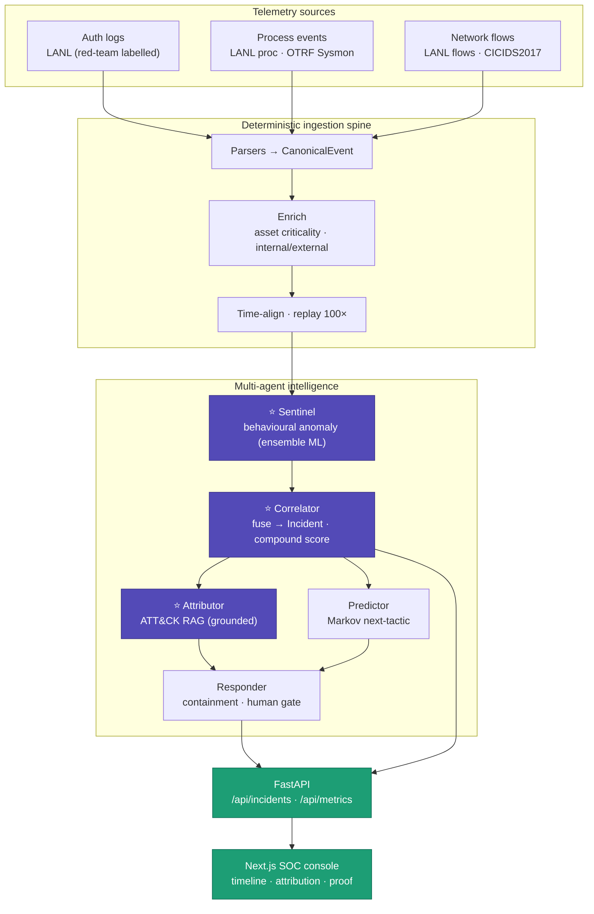
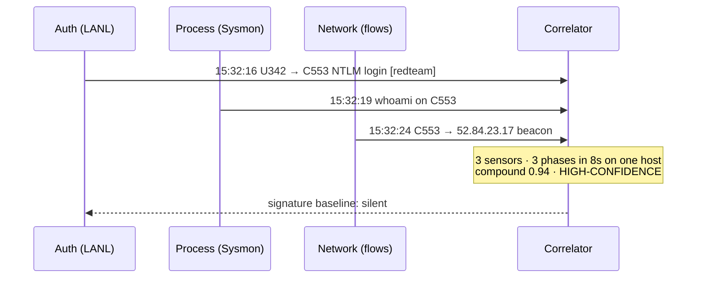
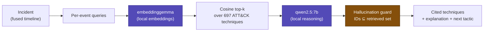
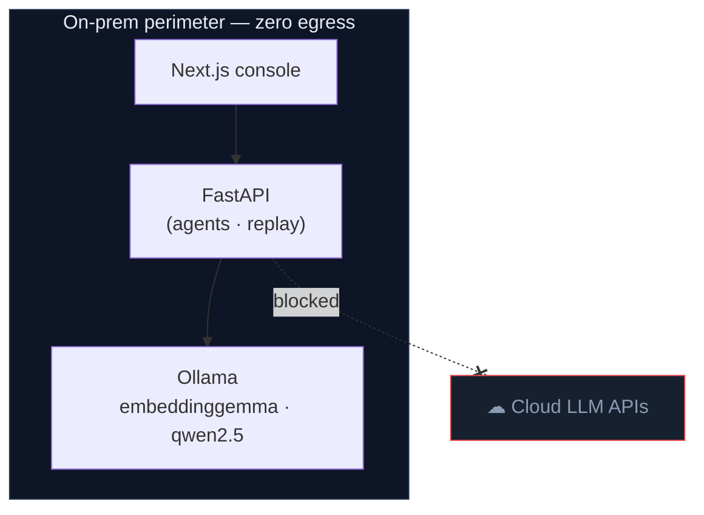

# Prahari — Architecture

**Prahari (प्रहरी · "sentinel")** — AI-driven cyber resilience for critical national
infrastructure. Behavioural (not signature) threat detection that fuses auth + process +
network telemetry into one incident timeline, maps it to MITRE ATT&CK with cited reasoning,
and runs **fully air-gapped**.

Diagrams below reflect the **implemented** system.

---

## 1. System overview

**Golden rule:** real ML does the *detection*; the LLM only *reasons and explains*. Enrich
deterministically, then reason.

---

## 2. Agent topology → problem-statement coverage

Each agent maps to one of the five "what you may build" components. Three built for real,
two lightweight — full coverage anchored by depth.

| Agent | Job | Brain | PS component |
|---|---|---|---|
| **Sentinel** | Per-entity behavioural baselines; scores deviations | Isolation Forest + learned novelty (UEBA) | 1 Behavioural Anomaly Detection |
| **Correlator** | Fuse multi-source events → one Incident | Deterministic; kill-chain phases; compound score | (challenge core) |
| **Attributor** | Map Incident → ATT&CK techniques, cited | RAG: embeddinggemma + qwen2.5 (local) | 2 APT Attribution |
| **Predictor** | Likely next tactic | Markov over ATT&CK tactics | 2 APT Prediction |
| **Responder** | Gated containment recommendation | Playbook + human gate (simulated) | 3 Autonomous Response |
| Vuln view | CVE / criticality context | lookup | 4 Vulnerability Prioritisation |
| Digital twin | Attack-path view | graph (roadmap) | 5 Cyber Resilience Digital Twin |

---

## 3. The money moment — cross-source fusion

The core of the challenge: three unremarkable events, fused on one entity's timeline,
trace a low-and-slow intrusion no single sensor would flag.

Verified on **real LANL data**: 9 of 11 red-team hosts fuse auth + process + network into
`high_confidence` incidents (`docs/benchmarks/lanl-multisource-results.md`).

---

## 4. Attribution pipeline (grounded RAG, air-gapped)

No cloud API, no egress. Corpus embedded once in-memory (numpy) — no vector DB needed for
~700 docs.

---

## 5. Sovereign / air-gapped deployment

Classified OT/IT telemetry legally cannot leave the perimeter. Prahari runs entirely local —
the differentiator no cloud-API SOC can match on national infrastructure. `docker-compose`
brings up api · web · chroma · ollama.

---

## 6. Tech stack

| Layer | Choice |
|---|---|
| Ingestion / replay | Python generators + timer (~100×), no Kafka |
| Detection | scikit-learn Isolation Forest + learned novelty (UEBA); StandardScaler for network |
| Attribution | Ollama (`embeddinggemma` + `qwen2.5:7b`) + numpy cosine retrieval |
| Correlation | kill-chain tagging + compound scoring (pure Python) |
| Backend | FastAPI + Pydantic |
| Frontend | Next.js (App Router) + Roboto |
| Deploy | docker-compose · SOVEREIGN_MODE (zero egress) |

---

## 7. Evidence (measured, recorded)

| Claim | Result | Source |
|---|---|---|
| Behavioural vs signature recall on real LANL red-team | **0.79 vs 0.00** | `benchmarks/lanl-real-results.md` |
| Real multi-source fusion | 9/11 red-team hosts → high_confidence | `benchmarks/lanl-multisource-results.md` |
| ATT&CK attribution (air-gapped, grounded) | C553 → T1021.006 / T1057 / T1071.002 | `benchmarks/attribution-demo.md` |
| MTTD | weeks → ~seconds (replay) | dashboard |
| Auditability | every Incident carries raw evidence | `CanonicalEvent.raw` |

Full auditability: every automated decision traces to the exact raw records that triggered it.
